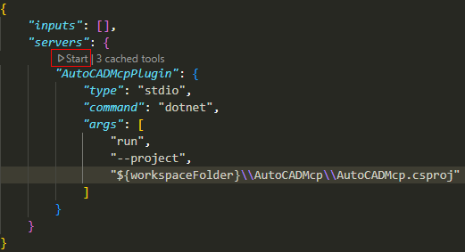
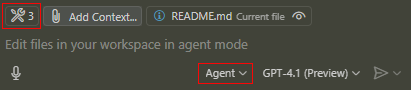

<h1 align="center">
  AutoCAD MCP Plugin
</h1>

<p align="center">
  <a href="/README.md">English</a> •
  <a href="/docs/README-ja.md">日本語</a>
</p>

## プロジェクトの目的

AutoCAD MCP Pluginは、AutoCADとAIアシスタント（GitHub CopilotやClaudeなど）をModel Context Protocol (MCP) を通じて連携させるためのプラグインです。AIツールがAutoCADにプログラム的にアクセスし、コマンド実行や情報取得を自動化できます。

## プラグインの使い方

1. vscodeの`Run and Debug`から`AutoCAD Debug`を選択してデバッグを開始します。
2. AutoCADを起動し、`NETLOAD`コマンドで`AutoCADMcpPlugin.dll`をロードします。
3. コマンドラインに `STARTMCP` と入力してMCPサーバーを起動します。

## MCPでの接続方法

### GitHub CopilotでMCP接続

1. `.github/mcp.json`からMCPサーバー（AutoCadMcp）を起動します。
2. Copilot ChatをAgentモードに切り替えて、左上のスパナからAutoCADMcpサーバーが追加されていることを確認します。
3. Copilot Chatで「AutoCadで円を描いて」などの指示を出すと、MCPサーバーを介してAutoCADが操作されます。

参考: https://docs.github.com/ja/copilot/customizing-copilot/extending-copilot-chat-with-mcp

### Claude DesktopでMCP接続

1. ソリューションをビルドし、`AutoCadMcp`の実行ファイルを作成します。
2. [Claude DesktopのMCP接続方法](https://modelcontextprotocol.io/quickstart/user)を参考にMCP設定ファイルを開きます。
3. サーバーにビルドした実行ファイルを指定します。
```yaml
{
  "mcpServers": {
    "AutoCADMcp": {
      "command": "\\path\\to\\AutoCadMcp.exe",
    }
  }
}
```
4. Claude Desktopを再起動し、ツールにMCPサーバーが追加されていることを確認します。
5. 「AutoCadで円を描いて」などの指示を出すと、MCPサーバーを介してAutoCADが操作されます。

## 注意事項

- サーバー停止は `StopMcp` コマンドで行えます。
- プラグインやMCPサーバーの起動順序に注意してください。
- 詳細な拡張方法やイベント追加方法はプロジェクト内のドキュメントを参照してください。